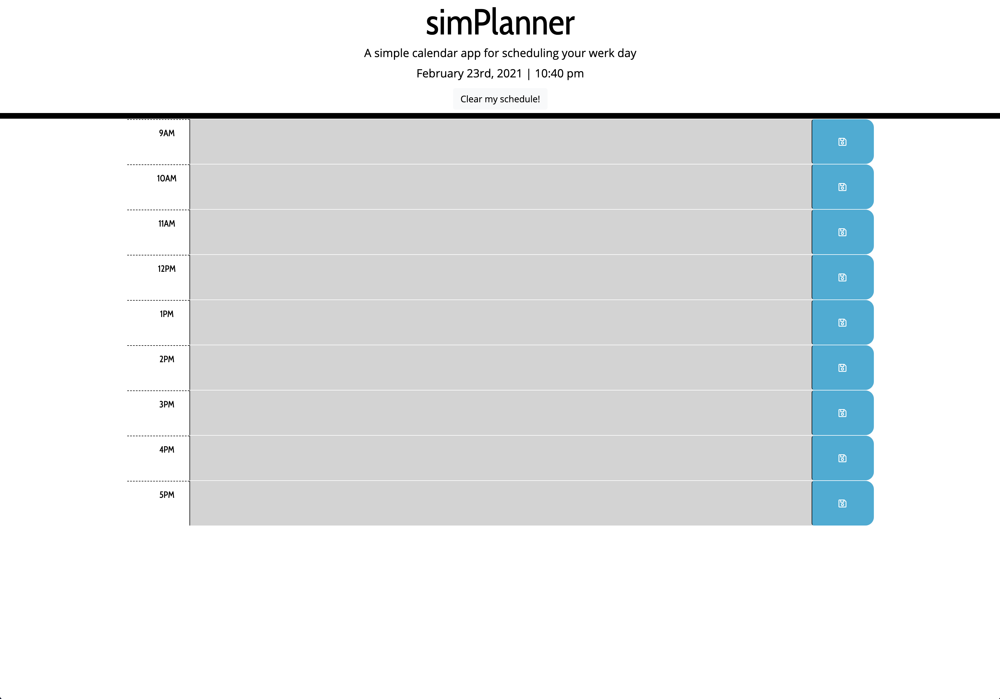

# simPlanner

A simple calendar app for scheduling your werk day.

## Features

* *Current day is displayed at the top of the calendar*
* *Contains timeblocks for standard business hours*
* *Each timeblock is color coded to indicate whether it is in the past, present, or future*
* *Save feature for each timeblock which saves data to local storage*

## Screenshot

---

## Link

>Visit [simPlanner](https://anthonyapicella.github.io/simPlanner/) to start organizing your day!